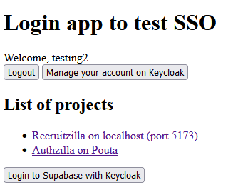

# Login app documentation

## Description

When you login to Keycloak with login-app, it will display links to another projects where authenticating with Keycloak is possible.
Then you can go to Recruitzilla and click "Log in with Keycloak" and it will log you into Keycloak and to Supabase through Keycloak without the need to type your credentials.

If you login in Recruitzilla with Keycloak and then go to login-app, you will be automatically logged in with login-app.
Login-app only uses Keycloak for logging in and keycloak-js initialized Keycloak client and checks for SSO.

Currently Recruitzilla does not use keycloak-js. Even if it did, it would not automatically sign into Supabase through Keycloak without clicking a button.
Keycloak-js also refreshes the page twice which does not add to the user experience.

## Notes
Recruitzilla uses Supabase for authentication. Keycloak is just one way to get authenticated with Supabase.
If Keycloak session is terminated (e.g. with admin console), user will still stay logged in in Recruitzilla. We could use keycloak-js method logout() to terminate Keycloak session in Recruitzilla if we wanted to.

## Demo

## Steps on how to make

In Keycloak
- In the same realm with another client, set up a new client
    - Users are shared between clients
- Client type: OpenID Connect
- Client ID: login-app
- Client authentication: OFF
- Authentication flow: Standard flow, direct access grants (default settings)
- Root URL: http://localhost:5174/*
- Valid redirect URIs: http://localhost:5174/*
- Web origins: http://localhost:5174 
In frontend (login-app)
- Npm install keycloak-js
- Npm install @react-keycloak/web (deprecated)
    - https://github.com/authts/react-oidc-context
    - Newer one but haven’t tried it
- /src/keycloak.js, insert keycloak configuration
    - realm (fullstackauth)
    - url (https://keycloak.ilab.fi:8443)
    - clientId (login-app)
- more configs for keycloak init: https://www.keycloak.org/docs/latest/securing_apps/index.html#methods
- API reference: https://www.keycloak.org/docs/latest/securing_apps/index.html#api-reference
    - Keycloak.authenticated, true if user authenticated
    - Keycloak.tokenParsed, parsed token as JavaScript object
    - Keycloak.login()
    - Keycloak.logout()

## Some more info
OIDC has different flows that can be used. Authorization Code Flow is for browser-based applications like SPAs (Single Page Applications) or server-side applications.
Authentication flows: https://darutk.medium.com/diagrams-and-movies-of-all-the-oauth-2-0-flows-194f3c3ade85
Ours uses standard flow, authorization code flow
https://www.thomasvitale.com/keycloak-authentication-flow-sso-client/
From official documentation: https://www.keycloak.org/docs/latest/securing_apps/#supported-grant-types
Open ID Connect (OIDC) documentation: https://openid.net/specs/openid-connect-core-1_0.html (chapters 1-3)
OAuth 2.0: https://auth0.com/intro-to-iam/what-is-oauth-2

